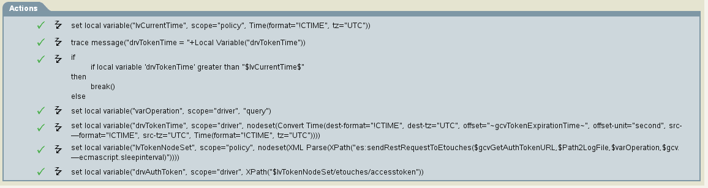

# Execute ECMA script based on time interval and parse XML doc

Several actions required

1) Setup local variable for comparison
```
    <do-set-local-variable name="lvCurrentTime" scope="policy">
			<arg-string>
				<token-time format="!CTIME" tz="UTC"/>
			</arg-string>
		</do-set-local-variable>
```

2) Trace driver variable to trace file (Not required but useful for manual evalution in trace)
```
    <do-trace-message>
			<arg-string>
				<token-text xml:space="preserve">drvTokenTime = </token-text>
				<token-local-variable name="drvTokenTime"/>
			</arg-string>
		</do-trace-message>
```

3) Compare local variable to driver variable.  
   If the driver variable is greater than current time break.
   If driver variable is less than current time than execute following actions.
```
    <do-if>
			<arg-conditions>
				<and>
					<if-local-variable mode="numeric" name="drvTokenTime" op="gt">$lvCurrentTime$</if-local-variable>
				</and>
			</arg-conditions>
			<arg-actions>
				<do-break/>
			</arg-actions>
			<arg-actions/>
		</do-if>
```

4) Update driver variable with interval provided by a gcv value.  This example used an interger gcv of 60 seconds.
```
    <do-set-local-variable name="drvTokenTime" scope="driver">
			<arg-node-set>
				<token-convert-time dest-format="!CTIME" dest-tz="UTC" offset="~gcvTokenExpirationTime~" offset-unit="second" src-format="!CTIME" src-tz="UTC">
					<token-time format="!CTIME" tz="UTC"/>
				</token-convert-time>
			</arg-node-set>
		</do-set-local-variable>
```

5) Execute ECMA script and provide XML doc in a nodeset
```
  <do-set-local-variable name="lvTokenNodeSet" scope="policy">
			<arg-node-set>
				<token-xml-parse>
					<token-xpath expression="es:sendRestRequestToEtouches($gcvGetAuthTokenURL,$Path2LogFile,$varOperation,$gcv.ecmascript.sleepinterval)"/>
				</token-xml-parse>
			</arg-node-set>
		</do-set-local-variable>
```

6) Value of node from XML doc
```
    <do-set-local-variable name="drvAuthToken" scope="driver">
			<arg-string>
				<token-xpath expression="$lvTokenNodeSet/etouches/accesstoken"/>
			</arg-string>
		</do-set-local-variable>
```

Actions should look like this:

